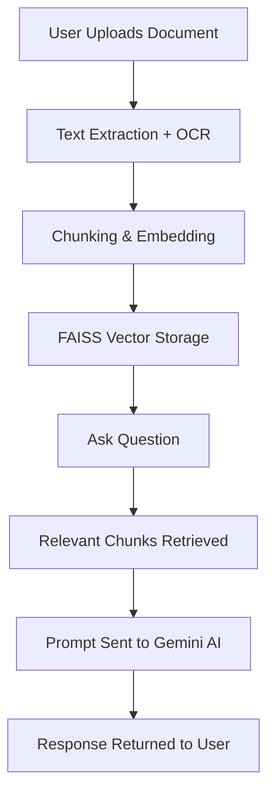

# 🧠 AskScribe — AI-Powered Document Intelligence System

**AskScribe** is an intelligent document analysis tool built with **Flask**, combining **Google Gemini AI** and **FAISS vector search** to help users ask questions about uploaded documents in natural language. Whether you're scanning PDFs, DOCX, or TXT files — AskScribe extracts, indexes, and intelligently answers with structured, professional responses.

<p align="center">
  
  
</p>

---

## 🚀 Features

- 📂 Upload PDFs, DOCX, and TXT files  
- 🧠 Ask questions and get structured, **context-aware** answers  
- 🧾 Supports **multi-session** chat history  
- 🔍 Custom **TF-IDF + FAISS** vector search engine  
- 🖼️ **OCR support** for scanned documents  
- 💬 Gemini-powered LLM responses with Markdown formatting  
- 🔐 Secure **user authentication and session handling**  
- 📁 Embedded file management, chunking, and vector indexing

---

## 📁 Project Structure

```
DocumentIntelligence/
│
├── templates/              # HTML (Jinja2)
├── static/                 # CSS/JS/Assets
├── uploads/                # Uploaded documents
├── vectors/                # Stored vector index (JSON)
│
├── main.py                 # Entry point
├── routes.py               # App routes
├── gemini_client.py        # Gemini integration
├── rag_engine.py           # Vector search & RAG engine
├── models.py               # SQLAlchemy models
├── utils/                  # OCR, chunking, preprocessing
├── requirements.txt        # Dependencies
└── README.md
```

---

## ⚙️ Getting Started

### 1️⃣ Clone & Setup

```bash
git clone https://github.com/yourusername/askscribe.git
cd askscribe
python -m venv venv
source venv/bin/activate  # or venv\Scripts\activate on Windows
pip install -r requirements.txt
```

### 2️⃣ Environment Variables

Create a `.env` file and add:

```env
GEMINI_API_KEY=your_google_gemini_key
SESSION_SECRET=your_flask_secret
```

### 3️⃣ Run the App

```bash
python main.py
```

Visit `http://localhost:5000` in your browser.

---

## 🧠 How It Works

### 📂 Document Upload  
Users upload files → Extract content → Chunk → Generate TF-IDF embeddings → Store with FAISS

### ❓ Question Answering  
User asks question → Retrieve top relevant chunks → Construct prompt → Gemini generates answer

### 💬 Chat Interface  
Real-time Q&A → History stored per session → View or continue previous chats

---

## 🧰 System Architecture

### 🎨 Frontend Architecture
- **Framework**: Bootstrap 5.3.2 with dark theme  
- **Styling**: Custom CSS with ChatGPT-inspired dark interface  
- **JavaScript**: Vanilla JS with Bootstrap components  
- **Templates**: Jinja2 templating engine  
- **Features**: Responsive design, file upload validation, real-time chat interface  

### 🧰 Backend Architecture
- **Framework**: Flask with SQLAlchemy ORM  
- **Authentication**: Flask-Login for session management  
- **Database**: SQLite (configurable via DATABASE_URL)  
- **File Processing**: Multi-format document processing with OCR  
- **AI Integration**: Google Gemini 2.5 Flash model  
- **Vector Search**: FAISS for efficient similarity search  

---

## 🔍 Key Components

### 📄 Document Processing Pipeline
- **Text Extraction**: Full support for PDF (PyMuPDF), DOCX, and TXT  
- **OCR**: Automatic Tesseract fallback for scanned documents  
- **Chunking**: 1000-char chunks with 200-char overlap  
- **Embeddings**: Custom TF-IDF embeddings (lightweight)  

### ⚙️ RAG Engine
- **Vector Store**: JSON-based TF-IDF + FAISS similarity  
- **Retrieval**: Cosine similarity for top-matching chunks  
- **LLM Generation**: Prompt engineering with Gemini AI  

### 🔐 Authentication
- **User System**: Registration, login, logout  
- **Session Handling**: Secure cookie-based sessions with Flask-Login  
- **Protected Routes**: Auth-required pages  

### 💬 Chat System
- **Session Support**: Multi-chat session per user  
- **Chat History**: Stored persistently in database  
- **Contextual Q&A**: Gemini answers are always based on document context  

---

## 🔁 Data Flow (Mermaid)



<pre> 
  ```mermaid flowchart TD %% Authentication Flow A1[👤 User Registers / Logs In] --> A2[🔐 Flask-Login Handles Session] A2 --> A3{✅ Authenticated?} A3 -- Yes --> A4[🔓 Access Dashboard] A3 -- No --> A5[🚫 Redirect to Login] %% Document Upload Pipeline B1[📤 Upload PDF / DOCX / TXT] --> B2{📄 Contains Text?} B2 -- Yes --> B3[📝 Extract Text via Parser] B2 -- No --> B4[🖼️ Run Tesseract OCR] B3 & B4 --> B5[📦 Chunk Text (1000 char, 200 overlap)] B5 --> B6[🧠 Generate TF-IDF Embeddings] B6 --> B7[💾 Store in FAISS Index + Metadata DB] %% Question-Answering Flow C1[❓ User Asks Question] --> C2[🔍 Search Relevant Chunks (FAISS)] C2 --> C3[📋 Construct Prompt with Context] C3 --> C4[🤖 Gemini API Generates Answer] C4 --> C5[💬 Display Answer in Chat UI] C5 --> C6[🗂️ Save Chat Message to DB] %% Session Management A4 --> D1[🆕 Create or Select Chat Session] D1 --> C1 %% Visual Connections A4 --> B1 ``` </pre>

---

---

## 🛠️ Tech Stack

| Layer       | Tools / Libraries                    |
|-------------|--------------------------------------|
| 🧠 AI Model  | Google Gemini 2.5 Flash              |
| 🔍 Search    | FAISS + TF-IDF (custom implementation) |
| 🧾 OCR       | Tesseract + Pillow                   |
| 🧰 Backend   | Flask, SQLAlchemy, SQLite            |
| 🎨 Frontend  | HTML, Bootstrap 5.3, JS              |
| 🔐 Auth      | Flask-Login                          |

---

## 🧪 Sample Gemini Prompt

```markdown
**Question**: What is the policy on leave?
**Context**: [Relevant chunks retrieved]
**Instructions**: Answer with headings, bullet points, and highlight **key terms**.
```

---

## 🔐 Security Features

- ✅ Secure file storage with size/type checks  
- ✅ CSRF protection & secure sessions  
- ✅ Environment-based secrets (no hardcoding)  
- ✅ Auto OCR fallback for scanned documents  

---

## 🔮 Future Upgrades

### 📤 Chat Export
Export session as PDF, Markdown, or TXT for offline sharing.

### ☁️ Cloud Uploads
Switch to Amazon S3 or Google Cloud Storage for large files.

### 📈 Analytics Dashboard
Track document types, most asked queries, usage trends.

### 🔔 Real-Time Notifications
Get alerts for OCR status, Gemini API limits, and timeouts.

---

## 📄 License

This project is licensed under the **MIT License**. See the [LICENSE](./LICENSE) file for more info.

---

## 👨‍💻 Author

Made with ❤️ by **Md Meraj Alam**  
_Your feedback is always welcome!_
